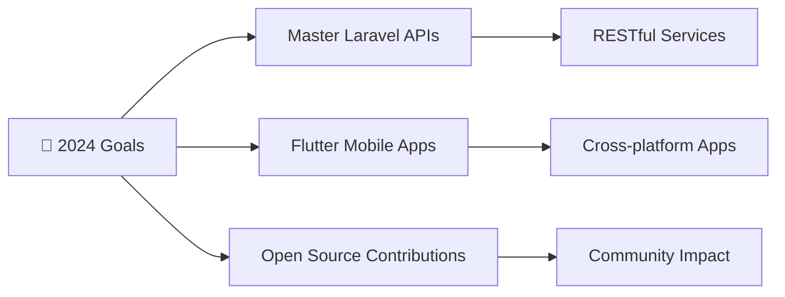
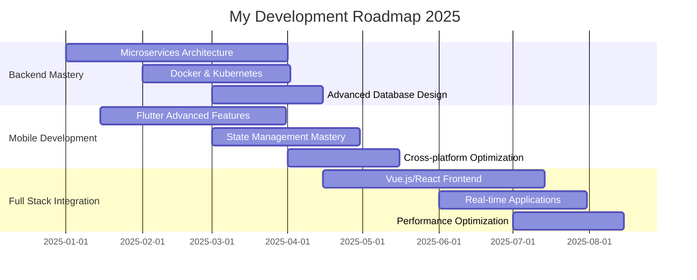

<div align="center">

  <!-- Animated Header -->
  

  <!-- Cool Banner -->
  

  <!-- Profile Views & Social -->
  <p>
    
    
    
  </p>

</div>

---


### 👨‍🎓 About Me

```typescript
const rizki = {
    name: "Rizki Akhmal",
    age: 16,
    location: "Indonesia 🇮🇩",
    role: "Full Stack Developer",
    languages: ["PHP", "Dart", "JavaScript", "SQL"],
    frameworks: ["Laravel", "Flutter", "Bootstrap"],
    currentFocus: "Building scalable web & mobile apps",
    funFact: "I debug with console.log() and I'm proud of it! 😄"
};
```

- 🔭 Currently working on **Laravel** and **Flutter** projects
- 📱 Building mobile apps with **real backend APIs**
- 🎯 Learning **fullstack development** and writing **clean code**
- � Love solving problems and building systems from scratch
- 📫 Reach me: **iki.akhmal08@gmail.com**

---

### 💻 Tech Stack

<div align="center">

#### 🚀 Backend Development


#### 📱 Frontend & Mobile


#### 🛠️ Tools & Technologies


</div>

### 📊 Skill Levels

<div align="center">

| Technology | Proficiency |
|------------|-------------|
| **Laravel** |  |
| **Flutter** |  |
| **PHP** |  |
| **Dart** |  |
| **MySQL** |  |
| **Git** |  |

</div>

---

### 🏆 GitHub Trophies
<div align="center">
  
</div>

### 📈 GitHub Analytics

<div align="center">
  
  
</div>

### 📊 Contribution Graph
<div align="center">
  
</div>

### ⚡ Recent Activity
<div align="center">
  
</div>

---

### 🚀 My Awesome Projects

<div align="center">
  
</div>

#### 📱 Mobile Applications

**🛍️ E-Commerce Flutter App**
- **Tech Stack:** Flutter, Dart, Laravel API, MySQL
- 📦 Complete shopping experience with cart & checkout
- 🔐 User authentication & profile management
- 💳 Payment gateway integration
- 📊 Admin dashboard for inventory management

**📚 Learning Management System**
- **Tech Stack:** Flutter, Firebase, Provider
- 👨‍🎓 Student & teacher portals
- 📝 Assignment submission system
- 💬 Real-time chat functionality

#### 🌐 Web Applications

**🏥 Hospital Management System**
- **Tech Stack:** Laravel, MySQL, Bootstrap, jQuery
- 👩‍⚕️ Doctor & patient management
- 📅 Appointment scheduling system
- 💊 Prescription & medical records

**🍕 Food Delivery Platform**
- **Tech Stack:** Laravel, Vue.js, MySQL, Stripe API
- 🍔 Restaurant & menu management
- 🚚 Real-time order tracking
- 💰 Payment processing integration

### 🎯 2024 Goals & Roadmap

<div align="center">



</div>

### 📚 Learning Journey & Goals


#### 🎯 Current Learning Goals (2024)
- [ ] **Microservices Architecture** with Laravel
- [ ] **Docker & Kubernetes** for containerization
- [ ] **Flutter Web** development
- [ ] **State Management** (Bloc, Riverpod)
- [x] **RESTful API** best practices ✅
- [x] **Database optimization** techniques ✅

#### 📖 Learning Resources
- **Laravel Documentation** - Official docs
- **Flutter.dev** - Official Flutter resources
- **Stack Overflow** - Problem solving
- **GitHub** - Open source exploration

#### 🏆 Learning Progress
```
Laravel Mastery     ████████░░ 80%
Flutter Development ███████░░░ 70%
Database Design     ██████░░░░ 60%
Git & Version Control ████████░░ 85%
Problem Solving     ███████░░░ 75%
```

### 🧩 Fun Facts & Interests

- 🧠 **Problem Solver**: Love debugging and optimizing code
- 🎮 **Game Developer**: Build games for fun in spare time
- 💡 **Learning Philosophy**: "Build it, break it, fix it, repeat"
- 🚀 **Dream Project**: Creating apps that impact millions
- ☕ **Fuel**: Coffee + Code = Magic ✨
- 🎵 **Coding Playlist**: Lo-fi beats while coding
- 🌟 **Fun Fact**: I debug with console.log() and I'm proud of it! 😄

---

### 🎮 Fun Mini Projects

<div align="center">

| Project | Tech Stack | Status | Demo |
|---------|------------|--------|------|
| 🐍 Snake Game | Flutter | ✅ Complete | [Play Now](#) |
| 🧮 Calculator App | Flutter | ✅ Complete | [Try It](#) |
| 📊 GitHub Stats Generator | Laravel API | 🔄 In Progress | [View](#) |
| 🔐 Password Generator | PHP | ✅ Complete | [Generate](#) |

</div>

### 🤝 Open Source Contributions

I believe in giving back to the community! Here are some ways I contribute:

- 🐛 **Bug Reports**: Found and reported issues in popular packages
- 📝 **Documentation**: Improved docs for Laravel and Flutter projects
- 💡 **Feature Requests**: Suggested enhancements for developer tools
- 🔧 **Code Contributions**: Small but meaningful PRs to open source projects

### 🌐 Let's Connect & Collaborate!

<div align="center">

[](https://www.instagram.com/rizkiakmal1)
[](mailto:iki.akhmal08@gmail.com)
[](https://github.com/RizkiAkhmal)
[](https://linkedin.com/in/rizkiakhmal)

**💬 Always open to interesting projects and collaborations!**

</div>

---

### 🎯 2025 Roadmap

<div align="center">



</div>

### 📊 Weekly Development Activity

<!--START_SECTION:activity-->
<!--END_SECTION:activity-->

### 🏅 GitHub Achievements

<div align="center">

**🎉 Recent Milestones:**
- 🌟 **50+ Stars** across repositories
- 👥 **25+ Followers** on GitHub
- 🔥 **100+ Commits** this year
- 📦 **10+ Repositories** created
- 🤝 **5+ Open Source** contributions

</div>

---

<div align="center">

### 💫 Inspirational Quote

*"The best way to predict the future is to create it."* - Peter Drucker


### 🎉 Thanks for Visiting!

**⭐ Star some repositories if you find them interesting!**
**🤝 Let's connect and build amazing things together!**


</div>

---

<div align="center">
  
</div>

<!--
🚀 BONUS FEATURES TO ADD LATER:
- Blog post integration with dev.to
- Spotify now playing widget
- Dynamic quotes API
- Weather widget for your location
- Visitor map showing where people visit from
- Latest YouTube videos (if you have a channel)
- WakaTime coding stats
- Leetcode/HackerRank stats
-->

---

<details>
<summary>🔧 <b>How to make your GitHub profile this awesome?</b></summary>

### Step-by-step guide:

1. **Create a special repository** with your username
2. **Add animated GIFs** from [GitHub's collection](https://github.com/Anmol-Baranwal/Cool-GIFs-For-GitHub)
3. **Use dynamic badges** from [Shields.io](https://shields.io/)
4. **Add typing animation** with [readme-typing-svg](https://github.com/DenverCoder1/readme-typing-svg)
5. **Include skill icons** from [skill-icons](https://github.com/tandpfun/skill-icons)
6. **Show GitHub stats** with [github-readme-stats](https://github.com/anuraghazra/github-readme-stats)
7. **Add progress bars** with [progress-bar.dev](https://progress-bar.dev/)
8. **Create diagrams** with Mermaid syntax
9. **Use GitHub Actions** for auto-updates
10. **Keep it updated** and personalized!

**Pro tip:** Always test your README locally before pushing! 🚀

</details>
